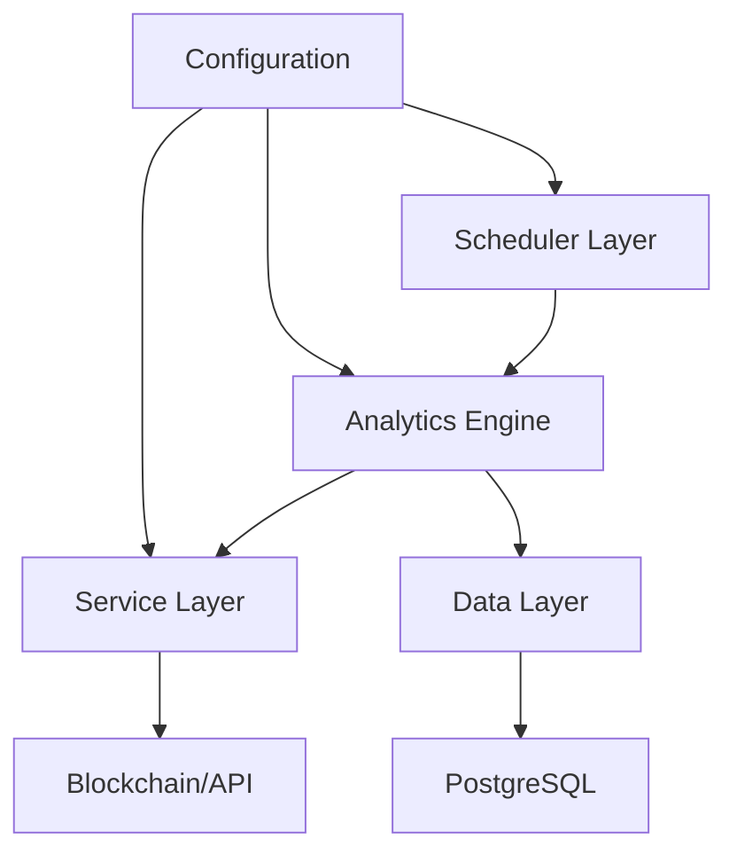

# Java Solana LP Option

一個基於 **Spring Boot** 的 Solana DeFi 分析系統，整合了 Deribit 選擇權資料收集、Raydium 流動性池監控和 CLMM Position 分析功能。專為 Solana 生態系統的 DeFi 應用提供全方位的數據分析與監控服務。

## 🏗️ **系統架構概覽**

本系統採用模組化設計，包含三大核心功能模組：

### 🎯 **核心技術棧**
- **框架**: Spring Boot 4.0.0-SNAPSHOT + Java 17
- **資料庫**: PostgreSQL + Spring Data JPA
- **區塊鏈**: Solana RPC 直接整合
- **排程**: Spring Scheduling 自動化任務
- **API**: RESTful + Jackson JSON 處理

### 📊 **三大主要功能模組**

#### 1. **Deribit 選擇權資料收集模組**
**檔案位置**: `DeribitInstrumentsRunner.java`, `DeribitOrderBookRunner.java`
- **自動排程**: 每8小時完整掃描 SOL 基礎選擇權工具
- **高頻監控**: 每3分鐘更新市場實時數據
- **希臘字母追蹤**: Delta, Gamma, Vega, Theta, Rho 完整收集
- **市場數據**: 指數價格、標的價格、隱含波動率監控
- **歷史存儲**: 所有數據存入 `option_data` 表，支援時間序列分析

#### 2. **Raydium V3 流動性池監控模組**
**檔案位置**: `RaydiumV3PoolInfoFetcher.java`
- **池資訊同步**: 自動獲取 Raydium DEX V3 池詳細資訊
- **TVL 追蹤**: 總鎖倉價值 (Total Value Locked) 監控
- **收益計算**: 24小時 APR、手續費年化收益率計算
- **交易量分析**: 24小時交易量統計與趨勢分析
- **定期更新**: 每8小時自動同步，數據存入 `raydium_v3_pool_data` 表

#### 3. **CLMM Position 分析模組** ⭐ *核心特色*
**檔案位置**: `CLMMPositionRunner.java`, `CLMMPositionAnalyzer.java`
- **實時區塊鏈數據**: 直接從 Solana 節點讀取 Position NFT 帳戶
- **智能 Tick 解析**: 自動解析 CLMM Position 的 tick 範圍數據
- **價格範圍計算**: 將 tick 數據轉換為實際價格範圍
- **收益追蹤**: 監控未領取手續費和流動性挖礦獎勵
- **批次處理**: 支援同時分析多個 Position，提供比較分析
- **四種分析模式**:
  - **單一分析**: 深度分析特定 Position
  - **批次分析**: 多 Position 對比分析
  - **快速檢查**: 關鍵指標快速預覽
  - **摘要報告**: 整體表現統計報告

### 🔧 **核心服務架構**

#### **區塊鏈服務層** (`SolanaService.java`)
- **RPC 客戶端**: 封裝 Solana RPC 調用，支援多端點配置
- **帳戶查詢**: `getAccountInfo`, `getMultipleAccounts` 批次查詢
- **程序帳戶搜索**: `getProgramAccounts` 智能篩選
- **CLMM 數據解析**: 專門的 Position 帳戶數據解析邏輯
- **Token Extensions**: 支援 Solana Token Extensions Program
- **容錯機制**: 自動重試、超時處理、連接健康檢查

#### **Position 分析引擎** (`CLMMPositionAnalyzer.java`)
- **多層數據整合**: 結合鏈上數據與 API 數據
- **實時計算引擎**:
  - Position 當前美元價值計算
  - TVL 佔比動態分析
  - 未領收益實時統計
  - 價格範圍有效性判斷
- **智能分析算法**:
  - Tick 到價格的精確轉換
  - 價格範圍內位置百分比計算
  - 流動性活躍狀態判斷
- **批次處理優化**: 高效的多 Position 並行分析

### 📈 **資料持久化與管理**
- **PostgreSQL 時間序列**: 優化的歷史數據存儲
- **JPA 實體映射**: 結構化的資料模型設計
- **智能索引**: 針對查詢模式優化的資料庫索引
- **數據歸檔**: 自動化的歷史數據管理策略

## 🚀 **核心功能特色**

### 🔄 **選擇權市場監控**
- **全天候追蹤**: 24/7 自動化市場數據收集
- **希臘字母完整性**: Delta, Gamma, Vega, Theta, Rho 精確計算
- **波動率分析**: 隱含波動率趨勢與歷史比較
- **風險指標**: 未平倉合約、成交量等關鍵指標

### 🏊 **AMM 流動性分析**
- **多池監控**: 同時追蹤多個 Raydium V3 流動性池
- **收益優化**: APR 計算與最佳化建議
- **流動性深度**: 池子流動性分布分析
- **套利機會**: 跨池價差監控與警報

### 📊 **CLMM Position 智能分析** ⭐
- **鏈上數據直連**: 零延遲的 Solana 節點數據獲取
- **Position 健康度**: 實時評估 Position 表現
- **收益最大化**: 手續費收入與 IL 風險平衡分析
- **價格預警**: 自定義價格範圍警報系統
- **Portfolio 管理**: 多 Position 組合分析與優化建議

### 🛡️ **企業級特性**
- **高可用性**: 故障自動恢復與降級機制
- **性能優化**: 智能緩存與並行處理
- **監控告警**: 完整的系統健康監控
- **安全保障**: API 限流、數據加密、權限控制

## 💡 **技術創新點**

### 🔬 **智能數據解析**
- **Tick 數學模型**: 精確的 CLMM tick 到價格轉換算法
- **NFT 元數據解析**: 自動化的 Token Extensions 處理
- **多程序相容**: 支援不同版本的 Raydium CLMM 程序

### ⚡ **高效能架構**
- **異步處理**: 非阻塞式 API 調用與數據處理
- **智能重試**: 指數退避重試機制
- **連接池**: 優化的資料庫連接管理
- **批次優化**: 高效的批次數據處理邏輯

### 🔗 **區塊鏈深度整合**
- **多 RPC 支援**: 自動故障轉移的 RPC 端點管理
- **實時同步**: 與 Solana 網路的實時數據同步
- **鏈上驗證**: 關鍵數據的鏈上驗證機制

## 🚀 快速開始

### 環境需求
```bash
- Java 17+
- PostgreSQL 12+
- Maven 3.6+
- Solana RPC 存取 (可選)
```

### 1. 複製專案
```bash
git clone <repository-url>
cd java-solana-lp-option
```

### 2. 設定資料庫
```sql
-- 建立資料庫
CREATE DATABASE solana_lp_db;

-- 建立使用者（可選）
CREATE USER your_username WITH PASSWORD 'your_password';
GRANT ALL PRIVILEGES ON DATABASE solana_lp_db TO your_username;
```

### 3. 設定應用程式
複製並修改設定檔：
```bash
cp src/main/resources/application.properties.example src/main/resources/application.properties
```

編輯 `application.properties`：
```properties
# 資料庫配置
spring.datasource.url=jdbc:postgresql://localhost:5432/solana_lp_db
spring.datasource.username=your_username
spring.datasource.password=your_password
spring.datasource.driver-class-name=org.postgresql.Driver

# JPA/Hibernate 配置
spring.jpa.hibernate.ddl-auto=update
spring.jpa.properties.hibernate.dialect=org.hibernate.dialect.PostgreSQLDialect
spring.jpa.show-sql=true

# Solana 節點配置
solana.rpcUrl=https://api.mainnet-beta.solana.com
solana.enableBlockchainData=true
solana.network=mainnet-beta
solana.connectTimeout=30000
solana.readTimeout=60000
solana.maxRetries=5

# 日誌配置
logging.level.org.hibernate.SQL=DEBUG
logging.level.com.example.java_solana_lp_option=INFO
```

### 4. 環境變數配置（可選）
```bash
# CLMM Position 分析
export CLMM_POSITION_ID=68Yz4qUkPPLHjcqpWraXQuLC7UoFUTrybohjEobnhB5o
export CLMM_BATCH_POSITION_IDS=68Yz4qUkPPLHjcqpWraXQuLC7UoFUTrybohjEobnhB5o,9WzDXwBbmkg8ZTbNMqUxvQRAyrZzDsGYdLVL9zYtAWWM
```

### 5. 執行應用程式
```bash
# 使用 Maven Wrapper
./mvnw spring-boot:run

# 或者先編譯後執行
./mvnw clean package
java -jar target/java-solana-lp-option-0.0.1-SNAPSHOT.jar
```

## 📁 **專案架構與檔案結構**

### 🏛️ **主要架構層級**

```
📦 Java Solana LP Option System
├── 🚀 應用程式啟動層 (Application Layer)
├── 🔄 排程任務層 (Scheduler Layer)  
├── 🧠 分析引擎層 (Analytics Engine)
├── 🌐 服務層 (Service Layer)
├── 💾 資料層 (Data Layer)
└── ⚙️ 配置層 (Configuration Layer)
```

### 📂 **詳細檔案結構**

```
src/main/java/com/example/java_solana_lp_option/
│
├── 🚀 JavaSolanaLpOptionApplication.java       # 🎯 主應用程式啟動點
│   ├── @SpringBootApplication                  # Spring Boot 自動配置
│   ├── @EnableScheduling                       # 啟用排程功能  
│   └── @EnableConfigurationProperties          # 啟用配置屬性
│
├── 📊 entity/ (資料實體層)
│   ├── OptionData.java                         # 📈 Deribit 選擇權資料實體
│   │   ├── 希臘字母欄位 (Delta, Gamma, Vega, Theta, Rho)
│   │   ├── 價格資訊 (指數價格, 標記價格, IV)
│   │   └── 時間戳記與狀態管理
│   └── RaydiumV3PoolData.java                  # 🏊 Raydium V3 池資料實體
│       ├── 池基本資訊 (Pool ID, 代幣對, 價格)
│       ├── 流動性指標 (TVL, 交易量, 手續費率)
│       └── APR 計算結果
│
├── 🗄️ repository/ (資料庫操作層)
│   ├── OptionDataRepository.java               # 📊 選擇權資料庫操作
│   │   ├── 按工具名稱查詢
│   │   ├── 時間範圍查詢
│   │   └── 自訂查詢方法
│   └── RaydiumV3PoolDataRepository.java        # 🔍 池資料庫操作
│       ├── 按池 ID 查詢
│       ├── 最新資料獲取
│       └── 歷史趨勢分析
│
├── ⏰ runner/ (排程任務層)
│   ├── DeribitInstrumentsRunner.java           # 🔄 Deribit 工具列表查詢器
│   │   ├── @Scheduled(cron = "0 0 */8 * * *") # 每8小時執行
│   │   ├── SOL 基礎工具掃描
│   │   └── 工具狀態管理
│   ├── DeribitOrderBookRunner.java             # ⚡ 高頻訂單簿資料查詢器  
│   │   ├── @Scheduled(cron = "0 */3 * * * *") # 每3分鐘執行
│   │   ├── 市場資料更新
│   │   └── 希臘字母計算
│   ├── RaydiumV3PoolInfoFetcher.java           # 🏊 Raydium 池資訊獲取器
│   │   ├── @Scheduled(cron = "0 0 */8 * * *") # 每8小時執行
│   │   ├── V3 池資訊同步
│   │   └── APR 計算與更新
│   └── CLMMPositionRunner.java                 # 🎯 CLMM Position 分析執行器
│       ├── @Scheduled(cron = "0 0 */8 * * *") # 定期檢查
│       ├── 手動分析觸發器
│       └── 批次處理協調器
│
├── 🧠 analyzer/ (分析引擎層)
│   └── CLMMPositionAnalyzer.java               # 🔬 CLMM Position 核心分析引擎
│       ├── 🔍 四種分析模式實現
│       │   ├── analyzeCLMMPosition()           # 單一 Position 深度分析
│       │   ├── analyzeBatchCLMMPositions()     # 批次 Position 比較分析
│       │   ├── quickStatusCheck()              # 快速狀態檢查
│       │   └── getPositionSummary()            # 摘要報告生成
│       ├── 📊 實時計算引擎
│       │   ├── calculatePriceFromTick()        # Tick 到價格轉換
│       │   ├── analyzePriceRange()             # 價格範圍分析
│       │   └── analyzePricePosition()          # 價格位置計算
│       ├── 🔗 區塊鏈數據整合
│       │   ├── fetchCLMMPositionData()         # CLMM 數據獲取
│       │   ├── getTokenExtensions()            # Token Extensions 解析
│       │   └── getPositionAccountFromChain()   # 鏈上帳戶數據讀取
│       └── 📈 收益分析模組
│           ├── analyzeTokenAmounts()           # 代幣數量分析
│           ├── analyzeUnclaimedFees()          # 未領手續費分析
│           └── displayCLMMAnalysis()           # 完整分析報告
│
├── 🌐 service/ (服務層)
│   └── SolanaService.java                      # ⛓️ Solana 區塊鏈服務
│       ├── 🔌 RPC 客戶端管理
│       │   ├── callSolanaRPC()                 # 通用 RPC 調用
│       │   ├── getAccountInfo()                # 帳戶資訊查詢
│       │   ├── getMultipleAccounts()           # 批次帳戶查詢
│       │   └── getProgramAccounts()            # 程序帳戶搜索
│       ├── 🏗️ CLMM 數據解析
│       │   ├── findCLMMPositionAccount()       # Position 帳戶查找
│       │   ├── parsePositionAccountData()      # Position 數據解析
│       │   └── scanForTickData()               # Tick 數據掃描
│       ├── 🎫 Token Extensions 處理
│       │   ├── getTokenExtensions()            # Token Extensions 獲取
│       │   ├── parseTokenExtensions()          # Extensions 解析
│       │   └── TokenExtensionsInfo 內部類     # Extensions 數據模型
│       └── 🛡️ 連接健康管理
│           ├── checkConnectionHealth()         # 連接健康檢查
│           ├── getNodeVersion()                # 節點版本獲取
│           └── createMockPositionAccount()     # 模擬數據創建
│
└── ⚙️ config/ (配置管理層)
    └── SolanaConfig.java                       # 🔧 Solana 配置管理
        ├── @ConfigurationProperties("solana")  # 配置屬性映射
        ├── RPC 端點配置
        ├── 超時與重試設定
        ├── 網路環境配置
        └── 安全性設定

📁 src/main/resources/
├── application.properties                      # ⚙️ 主配置檔案
└── application.properties.example             # 📝 配置範例檔案

📁 target/
└── java-solana-lp-option-0.1.jar              # 🚀 編譯後的可執行檔案
```

### 🔄 **模組間資料流向**



### 📋 **關鍵檔案功能說明**

| 檔案 | 主要功能 | 關鍵特性 |
|------|---------|---------|
| `CLMMPositionAnalyzer.java` | CLMM Position 分析核心 | ⭐ 四種分析模式、實時計算引擎 |
| `SolanaService.java` | 區塊鏈服務封裝 | 🔗 RPC 客戶端、數據解析、容錯機制 |
| `CLMMPositionRunner.java` | Position 分析執行器 | ⏰ 排程任務、手動觸發、批次處理 |
| `DeribitOrderBookRunner.java` | 高頻選擇權數據收集 | ⚡ 每3分鐘更新、希臘字母計算 |
| `RaydiumV3PoolInfoFetcher.java` | 流動性池監控 | 🏊 V3 池同步、APR 計算 |

## 📊 資料表結構

### option_data 表（Deribit 選擇權資料）
| 欄位名稱 | 類型 | 說明 |
|---------|------|------|
| id | BIGINT | 主鍵（自動遞增）|
| instrument_name | VARCHAR | 工具名稱 |
| state | VARCHAR | 狀態 |
| timestamp_value | BIGINT | 原始時間戳記 |
| formatted_time | VARCHAR | 格式化時間 |
| delta_value | DOUBLE | Delta 希臘字母 |
| gamma_value | DOUBLE | Gamma 希臘字母 |
| vega_value | DOUBLE | Vega 希臘字母 |
| theta_value | DOUBLE | Theta 希臘字母 |
| rho_value | DOUBLE | Rho 希臘字母 |
| index_price | DOUBLE | 指數價格 |
| mark_price | DOUBLE | 標記價格 |
| open_interest | DOUBLE | 未平倉合約 |
| mark_iv | DOUBLE | 標記隱含波動率 |
| created_at | TIMESTAMP | 建立時間 |

### raydium_v3_pool_data 表（Raydium 池資料）
| 欄位名稱 | 類型 | 說明 |
|---------|------|------|
| id | BIGINT | 主鍵（自動遞增）|
| pool_id | VARCHAR | 池 ID |
| mint_a_symbol | VARCHAR | 代幣 A 符號 |
| mint_b_symbol | VARCHAR | 代幣 B 符號 |
| price | DOUBLE | 當前價格 |
| tvl | DOUBLE | 總鎖倉價值 |
| fee_rate | DOUBLE | 手續費率 |
| day_volume | DOUBLE | 24H 交易量 |
| day_apr | DOUBLE | 24H APR |
| day_fee_apr | DOUBLE | 24H 手續費 APR |
| fetched_at | TIMESTAMP | 獲取時間 |

## 🎯 功能使用指南

### Deribit 選擇權分析
```java
// 系統會自動執行以下排程任務：
// - 每8小時：完整工具列表掃描
// - 每3分鐘：高頻市場資料更新

// 查詢特定工具的歷史資料
List<OptionData> data = optionDataRepository.findByInstrumentName("SOL_USDC-27JUN25-170-C");

// 查詢時間範圍內的資料
List<OptionData> rangeData = optionDataRepository.findByInstrumentNameAndCreatedAtBetween(
    "SOL_USDC-27JUN25-170-C", startTime, endTime);
```

### Raydium 池監控
```java
// 查詢特定池的歷史資料
List<RaydiumV3PoolData> poolData = raydiumRepository.findByPoolIdOrderByFetchedAtDesc("8sLbNZoA1cfnvMJLPfp98ZLAnFSYCFApfJKMbiXNLwxj");

// 查詢時間範圍內的池資料
List<RaydiumV3PoolData> rangeData = raydiumRepository.findByPoolIdAndFetchedAtBetweenOrderByFetchedAtDesc(
    poolId, startTime, endTime);
```

### CLMM Position 分析
```java
// 手動觸發 Position 分析
@Autowired
private CLMMPositionRunner positionRunner;

// 分析單一 Position
positionRunner.manualAnalyze("single", "68Yz4qUkPPLHjcqpWraXQuLC7UoFUTrybohjEobnhB5o");

// 批次分析
positionRunner.manualAnalyze("batch", "id1,id2,id3");

// 快速狀態檢查
positionRunner.manualAnalyze("quick", null);

// 生成摘要報告
positionRunner.manualAnalyze("summary", null);
```

## ⚙️ 排程配置

### Cron 表達式設定
```java
// Deribit 選擇權
@Scheduled(cron = "0 0 */8 * * *")  // 每8小時：00:00, 08:00, 16:00
@Scheduled(cron = "0 */3 * * * *")  // 每3分鐘

// Raydium 池資訊
@Scheduled(cron = "0 0 */8 * * *")  // 每8小時

// CLMM Position 檢查
@Scheduled(cron = "0 0 */8 * * *")  // 每8小時
```

## 🔧 CLMM Position 分析功能詳解

### 支援的分析類型
1. **單一 Position 分析**：深度分析特定 Position 的所有資訊
2. **批次 Position 分析**：同時分析多個 Position 並比較
3. **快速狀態檢查**：快速獲取 Position 的關鍵指標
4. **摘要報告生成**：統計所有 Position 的總體表現

### 分析指標
- **位置價值**：Position 的當前美元價值
- **TVL 佔比**：Position 在池中的佔比
- **未領收益**：累積但尚未領取的手續費和獎勵
- **價格範圍**：Position 的有效價格區間
- **活躍狀態**：當前價格是否在有效範圍內

### 區塊鏈數據整合
- **實時 tick 數據**：直接從 Solana 節點讀取 Position 帳戶
- **Token Extensions 支援**：完整解析 NFT 元數據
- **多程序相容**：支援不同版本的 Raydium CLMM 程序

## 🚨 故障排除

### 常見問題與解決方案

1. **資料庫連線失敗**
   ```bash
   # 檢查 PostgreSQL 狀態
   sudo systemctl status postgresql
   
   # 確認連線參數
   psql -h localhost -p 5432 -U your_username -d solana_lp_db
   ```

2. **Solana 節點連接問題**
   ```properties
   # 使用公共 RPC 節點
   solana.rpcUrl=https://api.mainnet-beta.solana.com
   
   # 或暫時停用區塊鏈數據
   solana.enableBlockchainData=false
   ```

3. **API 限制問題**
   ```properties
   # 調整重試設定
   solana.maxRetries=3
   solana.retryDelay=3000
   ```

4. **CLMM Position 404 錯誤**
   ```bash
   # 檢查 Position 是否仍然活躍
   # 或使用有效的 Position ID
   export CLMM_POSITION_ID=68Yz4qUkPPLHjcqpWraXQuLC7UoFUTrybohjEobnhB5o
   ```

### 日誌設定
```properties
# 調整日誌級別
logging.level.com.example.java_solana_lp_option=DEBUG
logging.level.org.hibernate.SQL=DEBUG

# CLMM 分析詳細日誌
logging.level.com.example.java_solana_lp_option.analyzer=TRACE
```

## 📈 性能優化建議

### 資料庫優化
```sql
-- 為查詢頻繁的欄位建立索引
CREATE INDEX idx_option_instrument_time ON option_data(instrument_name, created_at);
CREATE INDEX idx_pool_id_time ON raydium_v3_pool_data(pool_id, fetched_at);

-- 定期清理舊資料（可選）
DELETE FROM option_data WHERE created_at < NOW() - INTERVAL '30 days';
```

### API 呼叫優化
```properties
# 連線池設定
spring.datasource.hikari.maximum-pool-size=10
spring.datasource.hikari.minimum-idle=5

# 超時設定
solana.connectTimeout=15000
solana.readTimeout=30000
```

## 🛡️ 安全性考量

### API 金鑰管理
```bash
# 使用環境變數儲存敏感資訊
export DATABASE_PASSWORD=your_secure_password
export SOLANA_RPC_URL=https://your-private-rpc-endpoint.com
```

### 資料庫安全
```sql
-- 限制資料庫使用者權限
GRANT SELECT, INSERT, UPDATE ON option_data TO app_user;
GRANT SELECT, INSERT, UPDATE ON raydium_v3_pool_data TO app_user;
```

## 📊 監控與警報

### 應用程式健康檢查
```properties
# 啟用 Spring Boot Actuator
management.endpoints.web.exposure.include=health,info,metrics
management.endpoint.health.show-details=always
```

### 關鍵指標監控
- 資料庫連接狀態
- API 呼叫成功率
- Solana 節點連接狀態
- Position 分析成功率
- 排程任務執行狀態

## 🔄 版本更新記錄

### v1.3.0 (最新)
- ✨ 新增 CLMM Position 分析器
- 🔗 整合 Solana 區塊鏈數據讀取
- 📊 支援批次 Position 分析
- 🎯 實時價格範圍監控
- 💰 未領收益追蹤

### v1.2.0
- 🏊 新增 Raydium V3 池監控
- 📈 APR 計算與追蹤
- 🗄️ 池資料歷史儲存

### v1.1.0
- 🔄 選擇權資料自動排程收集
- 📊 希臘字母資料儲存
- ⏱️ 高頻市場資料更新

### v1.0.0
- 🚀 基礎應用程式架構
- 💾 PostgreSQL 資料庫整合
- 📡 Deribit API 整合

## 🤝 貢獻指南

1. Fork 專案
2. 建立功能分支 (`git checkout -b feature/AmazingFeature`)
3. 提交變更 (`git commit -m 'Add some AmazingFeature'`)
4. 推送到分支 (`git push origin feature/AmazingFeature`)
5. 開啟 Pull Request

### 開發規範
- 使用 Java 17 語法特性
- 遵循 Spring Boot 最佳實踐
- 添加適當的單元測試
- 更新相關文檔

## 📄 授權

本專案採用 MIT 授權 - 詳見 [LICENSE](LICENSE) 檔案

## 📞 聯絡方式

如有問題或建議，請：
- 提交 GitHub Issue
- 聯絡專案維護者
- 查看 [Wiki](wiki) 獲取更多文檔

---

## 🎯 使用案例

### DeFi 投資組合管理
- 監控 Raydium 流動性池的表現
- 追蹤 CLMM Position 的收益
- 分析選擇權市場的波動率趨勢

### 量化交易策略
- 基於希臘字母的選擇權策略
- 流動性挖礦收益優化
- 跨協議套利機會識別

### 風險管理
- Position 價格範圍監控
- 未領收益閾值警報
- 市場波動率風險評估

**注意**：請確保遵守相關 API 的使用條款和限制。本應用程式僅供教育和研究目的使用，投資決策請謹慎評估風險。